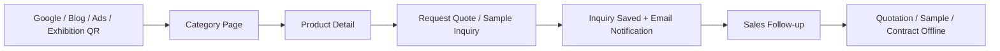
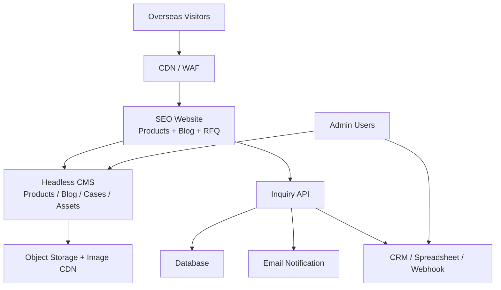
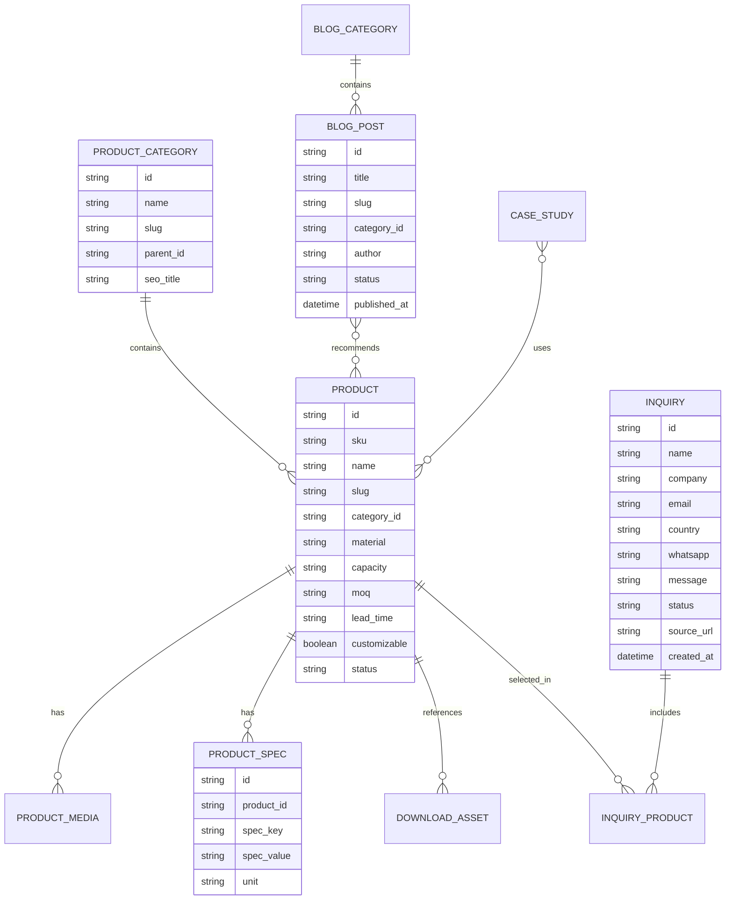

# 玻璃制品外贸独立站需求分析与系统设计

版本：v1.0  
日期：2026-06-06  
定位：无支付、无在线下单的询盘型外贸独立站，重点服务 Google SEO 获客、产品展示、博客内容营销、RFQ 询盘转化和销售跟进。

## 1. 项目定位

本网站不是传统零售商城，而是面向海外采购商的 B2B/B2B2C 获客站。核心目标是让海外客户快速判断“产品是否适合采购、工厂是否可信、询盘是否方便”，并把高质量线索沉淀到销售流程中。

主要适用品类：

- 玻璃杯、酒杯、咖啡杯、水杯、双层玻璃杯
- 玻璃罐、储物罐、食品罐、调料瓶
- 香薰蜡烛杯、化妆品玻璃瓶、精油瓶
- 高硼硅玻璃、钠钙玻璃、耐热玻璃制品
- OEM/ODM 定制：容量、形状、颜色、logo、包装、套装组合

## 2. 业务目标

- 建立英文为主、多语言可扩展的品牌型独立站。
- 通过产品页、分类页、博客文章和解决方案页获取自然搜索流量。
- 用 RFQ 表单、WhatsApp/Email、资料下载等入口提升询盘转化。
- 让海外客户看到工厂能力、质量控制、包装运输、认证文件和合作案例。
- 后台支持产品、博客、案例、资料和询盘统一管理。
- 为后续接入 CRM、邮件营销、展会名单、再营销广告预留接口。

## 3. 明确不做

- 不做在线支付。
- 不做购物车。
- 不做产品页下单、结账和订单状态。
- 不承诺实时库存、实时运费和自动报价。
- 不把网站设计成平台型商城，避免客户误以为可以直接零售购买。

## 4. 目标用户

| 用户类型 | 关注点 | 网站应提供的信息 |
| --- | --- | --- |
| 海外进口商/批发商 | MOQ、价格区间、装柜量、交期、认证 | 分类清晰、规格完整、RFQ 快速 |
| 品牌方/OEM 买家 | 定制能力、打样速度、包装、logo 工艺 | 定制流程、案例、工艺说明 |
| 电商卖家 | 热销款、轻量包装、防碎、条码/贴标 | 热销推荐、包装方案、样品申请 |
| 酒店/餐饮采购 | 耐用性、款式、补货周期 | 场景方案、套装、售后说明 |
| 采购代理 | 工厂资质、文件齐全、沟通效率 | 证书下载、工厂介绍、联系人 |

## 5. 站点信息架构

一级栏目建议：

- Home：首页
- Products：产品中心
- Custom Manufacturing：定制能力/OEM ODM
- Quality & Compliance：质量与认证
- Packaging & Shipping：包装与运输
- Cases：客户案例/项目案例
- Blog：博客
- About：工厂与公司介绍
- Contact / Request a Quote：联系与询盘

产品中心建议二级分类：

- Drinkware
- Glass Jars
- Candle Glass
- Cosmetic Glass Packaging
- Borosilicate Glassware
- Kitchen & Storage
- Custom Glass Products

博客建议栏目：

- Buying Guides：采购指南
- Materials & Process：材质与工艺
- Packaging & Shipping：包装运输
- Compliance & Testing：认证与测试
- Customization Ideas：定制灵感
- Market Trends：市场趋势

## 6. 核心用户路径

重点设计原则：

- 产品详情页不出现 Add to Cart、Buy Now、Checkout。
- 主要 CTA 使用 Get Quote、Request Sample、Ask for Customization、Contact Sales。
- 表单不是订单，而是采购意向收集。
- 博客文章要自然引导到相关分类、产品和询盘入口。

## 7. 功能需求

### 7.1 前台网站

首页：

- 首屏表达产品类型、外贸供货能力和询盘入口。
- 展示主力品类、工厂能力、定制能力、质量控制、客户案例和精选博客。
- 提供固定入口：Products、Blog、Request a Quote。

产品列表页：

- 支持按品类、用途、材质、容量、颜色、工艺、是否可定制筛选。
- 支持搜索产品名、SKU、容量、关键词。
- 展示产品图、名称、核心规格、MOQ 提示、可定制标签。
- 列表页 CTA：View Details、Get Quote。

产品详情页：

- 图片/视频展示：主图、场景图、细节图、包装图。
- 产品信息：SKU、材质、容量、尺寸、重量、颜色、MOQ、工艺、包装、交期范围。
- 定制选项：logo、颜色、磨砂、喷涂、烫金、贴花、丝印、包装盒。
- 文件资料：规格书、测试报告、包装说明、产品目录下载。
- 相关产品、相关博客、相关案例。
- 询盘组件：产品已预填，客户填写数量、目的国家、用途、定制要求和联系方式。
- 不提供下单、支付、购物车和订单确认。

博客：

- 支持分类、标签、作者、发布时间、更新时间。
- 支持 SEO 标题、描述、canonical、结构化摘要。
- 文章内推荐相关产品、相关资料下载和 RFQ 入口。
- 支持“采购指南型文章”和“问题解答型文章”，覆盖长尾关键词。

案例：

- 展示客户行业、目标市场、产品类型、定制需求、解决方案、结果。
- 避免泄露客户敏感信息，可用国家/行业替代具体客户名。

联系/询盘：

- 独立 RFQ 页面，支持多产品意向。
- 表单字段：姓名、公司、邮箱、电话/WhatsApp、国家、产品兴趣、预计数量、目标价格、定制要求、附件上传、预计采购时间。
- 成功后给客户展示确认页，并给销售团队发邮件。

### 7.2 后台 CMS

- 产品管理：分类、属性、规格、媒体、资料、SEO 字段、上下架。
- 博客管理：文章、分类、标签、作者、草稿、定时发布。
- 询盘管理：列表、详情、状态、销售负责人、备注、导出。
- 案例管理：行业、国家、产品、解决方案、图片。
- 下载资料管理：目录、证书、规格书、包装说明。
- 站点配置：导航、页脚、联系方式、社媒、SEO 默认值。
- 多语言管理：英文优先，后续扩展西班牙语、法语、德语、阿拉伯语等。

### 7.3 询盘管理

询盘状态建议：

- New：新询盘
- Qualified：有效询盘
- Need More Info：待补充信息
- Quoted：已报价
- Sample Sent：已寄样
- Won：成交
- Lost：未成交
- Spam：垃圾询盘

自动化动作：

- 新询盘邮件通知销售。
- 高意向询盘自动标记，例如数量大、公司邮箱、指定产品、上传图纸。
- 可导出 CSV/Excel。
- 可通过 Webhook 推送到 CRM、企业微信、飞书、HubSpot、Zoho 或自建 CRM。

## 8. 非功能需求

性能：

- 首屏加载尽量控制在 2 秒左右，图片使用 WebP/AVIF、懒加载和 CDN。
- 产品页和博客页适合静态生成或边缘缓存。

SEO：

- 清晰 URL，例如 `/products/glass-cups/borosilicate-double-wall-cup/`。
- 分类页、产品页、博客页独立 SEO 标题和描述。
- 自动生成 sitemap、robots、canonical。
- 多语言页面使用 hreflang。
- 产品页可使用 Product 结构化数据；若不公开价格，不输出虚假的 offer/price。
- 博客围绕采购问题做 topic cluster，例如 “how to choose glass candle jars for private label”。

安全：

- 后台账号支持强密码、2FA、角色权限。
- 表单防垃圾：验证码、蜜罐字段、提交频率限制、IP 风控。
- 文件上传限制类型、大小和病毒扫描。
- 管理端和 API 做 CSRF/XSS/SQL 注入防护。
- 管理日志记录关键操作。

合规：

- 面向欧盟客户时准备隐私政策、Cookie 提示和数据删除/访问请求流程。
- 食品接触类玻璃制品需展示或提供相关检测报告、重金属/铅镉控制说明。
- 认证页面不要过度承诺，仅展示真实证书和适用范围。

可维护性：

- 产品属性配置化，避免每新增品类都改代码。
- 博客和产品共用媒体库。
- 询盘字段可扩展。
- 站点文案和图片由后台维护，降低开发依赖。

## 9. 推荐技术架构

推荐方案：前台静态/SSR 网站 + Headless CMS + 询盘服务 + 邮件/CRM 集成。

前台：

- Next.js 或 Astro，重点支持 SEO、静态生成、图片优化和多语言。
- 如果内容量大且团队更重视编辑体验，可选择 WordPress 做 CMS，但不要启用商城结账链路。

后台：

- Headless CMS：Strapi、Directus、Sanity 或 WordPress Headless。
- 数据库：PostgreSQL 或 MySQL。
- 媒体存储：S3/R2/OSS + CDN。

集成：

- 邮件：SendGrid、Mailgun、Amazon SES 或企业邮箱 SMTP。
- CRM：HubSpot、Zoho、Pipedrive、自建 CRM 或飞书/企微 Webhook。
- 分析：GA4、Google Search Console、Microsoft Clarity，可叠加广告像素。

部署：

- 前台部署到 Vercel/Netlify/Cloudflare Pages 或自有服务器。
- CMS 与数据库部署到云服务器或托管平台。
- CDN/WAF 使用 Cloudflare。

## 10. 数据模型草案

## 11. 页面模板设计

首页模板：

- Hero：玻璃制品外贸供应能力 + 主 CTA。
- 主力产品分类。
- OEM/ODM 定制能力。
- 质量控制与认证。
- 包装运输能力。
- 成功案例。
- 博客精选。
- RFQ 区块。

产品详情模板：

- 产品图集。
- 核心规格摘要。
- RFQ 快捷表单。
- 详细规格表。
- 定制选项。
- 包装与装柜信息。
- 质量文件与下载。
- 相关产品和相关文章。

博客详情模板：

- 文章正文。
- 目录锚点。
- 相关产品。
- 下载资料。
- 询盘 CTA。
- FAQ。

## 12. SEO 内容策略

产品页覆盖采购决策关键词：

- wholesale glass cups
- custom glass jars manufacturer
- glass candle jars supplier
- borosilicate glassware factory
- private label glass packaging

博客覆盖问题型长尾关键词：

- How to choose glass jars for food packaging
- Borosilicate vs soda lime glass
- How to reduce breakage in international glassware shipping
- MOQ and lead time for custom glass cups
- What certificates are needed for glass food contact products

内容结构建议：

- 每个核心品类至少 1 个分类页、8-20 个产品页、5-10 篇博客。
- 每篇博客指向相关分类页和 2-4 个产品页。
- 产品页指向 1-3 篇采购指南，帮助客户补齐决策信息。

## 13. MVP 范围

第一阶段建议 4-6 周完成：

- 英文站首页、产品列表、产品详情、Blog、About、Contact/RFQ。
- 后台可维护产品、博客、案例和询盘。
- 30-80 个产品初始录入。
- 10-20 篇基础博客。
- Google Search Console、GA4、Clarity。
- sitemap、robots、canonical、基础结构化数据。
- 表单邮件通知和询盘后台。

第二阶段：

- 多语言。
- 下载中心。
- 高级筛选。
- CRM 集成。
- 展会落地页。
- 邮件订阅和内容再营销。

第三阶段：

- 客户门户或询盘历史。
- 在线样品申请审批。
- AI 辅助内容/产品推荐。
- 更完整的销售漏斗分析。

## 14. 验收指标

上线技术验收：

- 移动端、桌面端页面无明显错位。
- 产品页和博客页可被搜索引擎抓取。
- 表单提交、邮件通知、后台记录正常。
- 图片压缩和懒加载生效。
- 管理端权限和基础安全策略完成。

业务效果指标：

- 询盘转化率：访问 RFQ 或产品页后的提交率。
- 询盘质量：公司邮箱比例、目标国家、采购数量、定制信息完整度。
- SEO：自然流量、关键词曝光、博客入口页数量。
- 内容转化：博客到产品页/询盘页点击率。
- 销售响应：新询盘平均首次响应时间。

## 15. 参考基线

- Google Search Central：电商 URL 结构建议  
  https://developers.google.com/search/docs/specialty/ecommerce/designing-a-url-structure-for-ecommerce-sites
- Google Search Central：Product 结构化数据  
  https://developers.google.com/search/docs/appearance/structured-data/product
- Google Search Central：多语言 hreflang  
  https://developers.google.com/search/docs/specialty/international/localized-versions
- OWASP Top 10：Web 应用安全风险  
  https://owasp.org/www-project-top-ten/
- European Commission：食品接触材料说明  
  https://food.ec.europa.eu/food-safety/chemical-safety/food-contact-materials_en
- FDA：食品与食品器皿中的铅风险说明  
  https://www.fda.gov/food/environmental-contaminants-food/lead-food-and-foodwares
