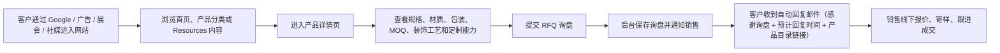
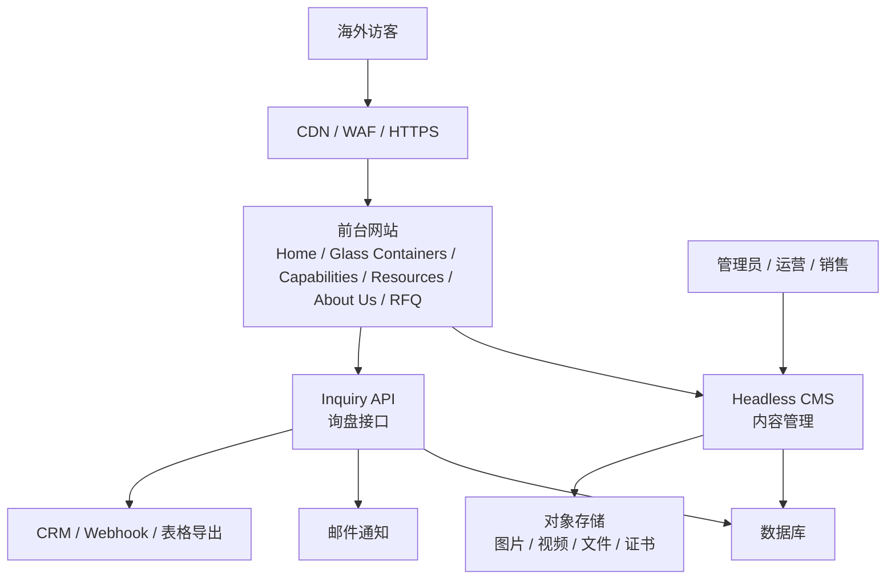

# 玻璃制品外贸独立站需求分析与系统设计

> **公司实体**：徐州鸿翀国际贸易有限公司（2026 年成立）  
> **办公地址**：江苏徐州铜山玻璃产业园  
> **业务模式**：玻璃容器专业外贸公司，依托铜山玻璃产业带，整合多家优质工厂资源，为海外客户提供一站式采购服务  
> **核心优势**：产业带核心位置（不是单一工厂，是一整个产业带的资源）+ 年轻团队响应快 + 初创公司服务意识强 + 不做大客户傲慢（中小订单也认真做）

## 1. 项目定位

本项目是一个销售玻璃容器类产品的外贸独立站。网站定位不是在线商城，而是询盘型获客网站，重点服务海外采购商、进口商、批发商、品牌方、电商卖家和渠道客户。

与单一工厂自营站不同，本网站依托**徐州铜山玻璃产业园的产业集群优势**，整合多家优质工厂的生产能力，为客户提供更广泛的产品选择、更灵活的定制方案和更严格的品控服务。

网站通过产品展示、供应链能力展示、关于我们、Resources 内容、RFQ 询盘表单等模块，帮助客户了解产品并发起采购咨询。

本网站不做支付系统，不做购物车，不做在线订单。产品页面只用于展示产品信息和引导客户发起询盘。

## 2. 建设目标

- 建立专业可信的玻璃容器外贸品牌独立站。
- 展示玻璃瓶、玻璃罐、玻璃花瓶三大产品体系。
- 通过产品页、分类页、博客、视频、下载和 FAQ 获取 SEO 流量。
- 通过 RFQ 询盘表单收集客户采购需求。
- 支持后台维护产品、Resources 内容、下载资料、关于我们内容和询盘数据。
- 将产业带优势、质量与认证、客户案例内容整合进 About Us，增强客户信任。
- 为后续多语言、CRM、邮件营销和广告投放预留扩展能力。

## 3. 明确不做的功能

- 不做在线支付。
- 不做购物车。
- 不做产品页直接下单。
- 不做订单管理。
- 不做实时库存。
- 不做实时运费计算。
- 不做自动报价系统。

## 4. 竞品深度分析

在建站之前，对两个直接竞品网站进行了深度分析：**HJ Glass Packaging** 和 **Roetell**。以下是完整分析结果。

### 4.1 竞品基础对比

| 维度 | HJ Glass Packaging | Roetell |
|------|-------------------|---------|
| URL | hjglasspackaging.com | roetell.com |
| CMS | WordPress + WooCommerce | WordPress + Elementor |
| SEO 插件 | Rank Math Pro | Yoast SEO |
| 成立年限展示 | 未突出展示 | **"Since 1984" 首页大字** ⭐ |
| 产品页面数 | ~28 | **1,222** |
| 博客文章数 | ~4 | **518** |
| 案例页面 | 无独立页面 | 16 个 |

### 4.2 网站结构对比

#### HJ Glass — 扁平结构

```
首页
├── 产品页（28个，无层级，每个独立 URL）
│   ├── /beverage-bottles/
│   ├── /mason-jars/
│   ├── /candle-jars/
│   └── ...（缺少分类层级）
├── Design And Development
├── Surface Decoration
├── Packaging And Shipping
├── After-Sales Service
├── Customized
├── About Us
├── Blog / Video / Download / FAQ
└── Contact Us
```

#### Roetell — 三层架构（更优）

```
首页
├── Glass Bottles（一级）
│   ├── Glass Beverage Bottles
│   ├── Glass Wine Bottles
│   ├── Glass Milk Bottles
│   ├── Hot Sauce Bottles
│   └── ...（20+ 子类）
├── Glass Jars（一级）
│   ├── Glass Candle Jars
│   ├── Glass Honey Jars
│   ├── Mason Jars
│   └── ...（15+ 子类）
├── Glass Vials（一级）
├── Industries → 按行业浏览（食品饮料 / 化妆品 / 医药）
├── Our Factory / Research & Development
├── Free Samples ← 亮点功能
├── Enquiry Cart ← 亮点功能
└── Blogs / Downloads / FAQ
```

### 4.3 Roetell 的 6 个亮点（值得借鉴）

| # | 亮点 | 说明 |
|---|------|------|
| 1 | **"Since 1984" 首页大字** | 瞬间建立信任，B2B 买家先看资历 |
| 2 | **Free Samples 独立页面** | 免费样品申请，降低客户决策门槛 |
| 3 | **Enquiry Cart（询盘购物车）** | 不是下单购物车，是把多个产品加入询盘清单，统一提交 |
| 4 | **按行业浏览** | 除了按产品类型，还可按食品饮料/化妆品/医药等行业进入 |
| 5 | **三级产品分类** | URL 含语义层级，对 SEO 和用户导航都好 |
| 6 | **下载中心** | 独立 Downloads 页提供产品目录 PDF |

### 4.4 两个竞品的共同弱点（我们的机会）

| 弱点 | HJ Glass | Roetell | 我们的对策 |
|------|---------|---------|-----------|
| 设计模板化 | WordPress 模板感 | Elementor 模板感 | frontend-design skill 做品牌定制设计 |
| 博客内容方向错 | 内容太少 | 518篇但大量是消费级（"bottle craft ideas"），来的是 DIY 爱好者不是 B2B 买家 | B2B 采购决策内容矩阵 |
| Schema 缺失 | 仅首页有 | **首页零 Schema** | Product + FAQ + Breadcrumb 全覆盖 |
| URL 不规范 | 扁平无层级 | 用下划线 `glass_categories`（应用连字符） | 三层连字符 URL |
| Meta Description 错误 | 英语质量差（"escort your packaging"） | **首页没写 Meta Description** | 每页必写含关键词+CTA |
| H1 灾难 | 合格 | 首页 H1 是 **"Home"** | 品类词 + 品牌 |
| Sitemap BUG | sitemap.xml 返回 HTML 页面 | 正常 | 确保 XML 可访问 + 自动生成 |
| 产品 Schema | 无 | 无 | 每个产品页加 Product Schema（无 price） |
| GEO 优化 | ❌ | ❌ | 抢先布局 AI 搜索引用 |

### 4.5 竞品 SEO 技术审计

#### HJ Glass — 技术 SEO 评分：C+

| 指标 | 数据 | 评价 |
|------|------|------|
| Title | "China Glass Bottle & Jar Manufacturer \| HJ Packaging"（56 chars） | ✅ 长度 OK |
| Meta Description | "China glass bottle manufacturer... escort your packaging" | ❌ 英语差，含拼写错误 |
| H1 | "Hua Jing — Your Trusted Glass Packaging Supplier in China" | ✅ 合格 |
| Schema | Organization + WebSite + Article（Rank Math 自动生成） | ⚠️ 仅首页，无产品 Schema |
| Sitemap | **sitemap.xml 返回 HTML 页面** | ❌ 严重 BUG |
| 图片 Alt | 92% | ✅ 优秀 |
| HTML 大小 | 188 KB | ⚠️ 偏大 |
| H2 结构 | "Wholesale Glass Bottle Supplier" / "Case Studies" / "Our Insights" | ✅ 合理 |

#### Roetell — 技术 SEO 评分：B-

| 指标 | 数据 | 评价 |
|------|------|------|
| Title | "Home - Reliable Glass Bottles, Jars, Containers Manufacturer \| Roetell"（70 chars） | ❌ "Home - " 浪费前 7 字符 |
| Meta Description | **未设置** | ❌ 首页无 Description |
| H1 | **"Home"** | ❌ 灾难级 |
| Schema | **零 Schema** | ❌ 首页无任何结构化数据 |
| Sitemap | 10 个子 sitemap，结构清晰 | ✅ 优秀 |
| 图片 Alt | 88% | ✅ 良好 |
| HTML 大小 | **371 KB** | ❌ 太重 |
| H2 结构 | "Custom Glass Bottle Jar & Container Manufacturer Since 1984" / "Wholesale All Glass Bottles" | ✅ 合理 |
| URL 问题 | 用 `glass_categories`（下划线）、`product_categories` | ❌ Google 推荐连字符 `-` |

#### 内容量对比

| 内容类型 | HJ Glass | Roetell |
|---------|----------|---------|
| 产品页 | ~28 | 1,222（sitemap1: 1000 + sitemap2: 222） |
| 博客文章 | ~4 | 518 |
| 页面数 | ~20 | 131 |
| 案例 | 无 | 16 |
| FAQ | 1 页 | 1 页 |
| 下载 | 有 Download 页 | 有 Downloads 页 |

> Roetell 的产品页面数是压倒性的，但也意味着每个产品页的 SEO 竞争稀释严重。我们的策略：**少而精，每页深度优化**。

### 4.6 基于竞品分析的 10 条行动建议

| # | 建议 | 来源 | 优先级 |
|---|------|------|--------|
| 1 | **首页大字展示产业带位置**：Located in Tongshan Glass Industrial Park, Xuzhou | 代替单一工厂的 "Since 1984" | 🔴 高 |
| 2 | **做询盘购物车（Enquiry Cart）**，收集产品→统一询盘 | Roetell | 🔴 高 |
| 3 | **做 Free Samples 独立页面** | Roetell | 🔴 高 |
| 4 | **产品分类做三层连字符 URL**：`/glass-containers/glass-bottles/` | 两个都没做对 | 🔴 高 |
| 5 | **增加"按行业浏览"入口**（食品饮料、化妆品、医药、家居） | Roetell | 🟡 中 |
| 6 | **深度案例页**：行业 + 需求 + 方案 + 结果 | 两个都不够好 | 🟡 中 |
| 7 | **产品详情页加"收藏到询盘列表"按钮** | Roetell Enquiry Cart | 🟡 中 |
| 8 | **博客写 B2B 采购指南**，不写消费级内容 | Roetell 博客方向错误 | 🟡 中 |
| 9 | **About Us 放产业带实景 + 合作工厂产线 + 质检流程照片** | 两个站都没做到位 | 🟡 中 |
| 10 | **GEO 优化率先布局** | 两个都没做 | 🟢 差异化 |

> 建议每季度重新分析竞品网站，更新差异化策略。

## 5. 目标用户

| 用户类型 | 关注重点 | 网站应提供内容 |
| --- | --- | --- |
| 海外进口商 | MOQ、价格区间、交期、证书 | 产品规格、询盘入口、认证资料 |
| 批发商 | 批量供货能力、包装、装柜量 | 分类页、包装说明、推荐产品 |
| 品牌方 | OEM/ODM、logo、表面装饰、包装定制 | 定制能力、工艺说明、案例 |
| 电商卖家 | 热销款、防碎包装、样品 | 产品推荐、样品询盘、Resources 内容 |
| 渠道客户 | 供货稳定性、售后服务、长期合作 | 关于我们、售后服务、客户案例 |

## 6. 网站栏目规划

### 6.1 一级导航

- Home：首页
- Glass Containers：产品中心
- Capabilities：能力中心
- Resources：资源中心
- About Us：关于我们
- Contact / Request a Quote：联系与询盘

### 6.2 Glass Containers 二级分类

产品中心分为三个大类：

- 玻璃瓶
- 玻璃罐
- 玻璃花瓶

### 6.3 Capabilities 二级导航

- 设计与开发
- 表面装饰
- 包装与运输
- 售后服务
- 定制化服务

### 6.4 Resources 二级导航

- 博客
- 视频
- 下载
- 常见问题解答

### 6.5 About Us 内容范围

About Us 不只是公司介绍，还需要承载信任建设内容。注意：我们是贸易公司而非工厂，重点展示产业带整合能力而非单一生产能力。

建议包含：

- 公司介绍：徐州鸿翀国际贸易有限公司，位于铜山玻璃产业园
- **产业带优势**（核心）：铜山玻璃产业带介绍、合作工厂网络、为什么位于产业带中心对客户意味着什么
- 供应链能力：多工厂调配、产能弹性、品类覆盖
- 质量与认证：品控流程、合作工厂认证、第三方检测
- 检测流程：从样品确认到大货抽检的完整 QC 体系
- 客户案例：按行业/国家展示合作成果
- 合作流程：从询盘到交付的清晰路径
- 团队与服务能力：销售、QC、跟单、售后

原独立一级栏目”质量与认证”和”客户案例”不再保留，其内容整合到 About Us 页面中展示。

## 7. 产品分类规划

### 7.1 玻璃瓶

- Glass Beverage Bottles
- Glass Milk Bottles
- Glass Water Bottles
- Glass Oil Bottles
- Glass Diffuser Bottles
- Hand Sanitizer Bottles
- Glass Medicine Bottles
- Glass Liquor & Spirit Bottles
- Mini Liquor Bottles
- Glass Beer Bottles
- Glass Swing Bottles
- Glass Sauce Bottles

### 7.2 玻璃罐

- Glass Mason Jars
- Glass Candle Jars
- Glass Spice Jars
- Food Storage Jars
- High Borosilicate Glass Jars
- Glass Honey Jar
- Jam Jelly Jars
- Glass Pickle Jars
- Glass Candy Jars
- Glass Coffee Jars
- Salt Pepper Grinder

### 7.3 玻璃花瓶

玻璃花瓶作为第三个产品大类，可根据后续产品线继续扩展二级分类。

建议初始方向：

- Decorative Glass Vases
- Clear Glass Vases
- Colored Glass Vases
- Tall Glass Vases
- Small Glass Vases
- Wedding Glass Vases
- Floral Glass Vases
- Custom Glass Vases

## 8. 核心业务流程



## 9. 功能需求

### 9.1 首页

首页需要快速传达网站的产品类型、外贸供货能力和可信度。

核心模块：

- 首屏品牌介绍与询盘 CTA。
- 三大产品入口：玻璃瓶、玻璃罐、玻璃花瓶。
- 热门产品推荐。
- Capabilities 服务能力入口。
- 产业带优势与供应链能力介绍。
- About Us 信任展示，包括质量与认证、客户案例摘要。
- Resources 精选内容，包括博客、视频、下载和 FAQ。
- Request a Quote 询盘入口。

### 9.2 Glass Containers 产品中心

产品中心用于帮助客户快速筛选目标产品。

功能要求：

- 按玻璃瓶、玻璃罐、玻璃花瓶三大类浏览。
- 支持进入具体二级分类。
- 支持关键词搜索。
- 支持按容量、用途、颜色、瓶口类型、材质、工艺、是否可定制筛选。
- 展示产品图片、名称、SKU、核心规格、MOQ、定制标签。
- 每个产品提供 View Details 和 Get Quote 入口。

### 9.3 产品详情页

产品详情页只做产品展示和询盘转化，不做下单。

页面内容：

- 产品图片、场景图、细节图、包装图。
- 产品名称、SKU、材质、容量、尺寸、重量。
- MOQ、交期范围、包装方式、装箱量。
- 可选颜色、logo、喷涂、磨砂、贴花、烫金、标签、瓶盖或包装盒等定制选项。
- 规格表。
- 下载资料：规格书、产品目录、测试报告、包装说明。
- 相关产品。
- 相关 Resources 内容。
- 询盘表单。

产品页 CTA：

- Get Quote
- Request Sample
- Ask for Customization
- Contact Sales

不出现：

- Add to Cart
- Buy Now
- Checkout
- Place Order
- Pay Now

### 9.4 Capabilities

Capabilities 是能力展示栏目，用于降低客户对定制、包装、交付和售后的疑虑。

#### 设计与开发

- 新品开发流程。
- 客户图纸、样品、参考图处理方式。
- 结构设计、容量设计、瓶口匹配建议。
- 打样周期说明。

#### 表面装饰

- 丝印。
- 喷涂。
- 磨砂。
- 烫金/烫银。
- 贴花。
- 电镀。
- 标签与贴标方案。

#### 包装与运输

- 外贸纸箱包装。
- 托盘包装。
- 防碎方案。
- 装柜建议。
- 海运、空运、快递样品寄送说明。

#### 售后服务

- 破损问题处理流程。
- 质量问题反馈流程。
- 补货与复购支持。
- 销售响应时效说明。

#### 定制化服务

- OEM/ODM 服务。
- logo 定制。
- 容量和形状定制。
- 颜色和工艺定制。
- 包装盒和标签定制。

### 9.5 Resources

Resources 是网站 SEO、内容营销和资料沉淀的核心栏目。

#### 博客

功能要求：

- 支持博客分类、标签、作者、发布时间、更新时间。
- 支持 SEO 标题、SEO 描述、URL slug。
- 支持文章封面图。
- 支持相关文章推荐。
- 支持文章内关联产品。
- 支持文章底部询盘 CTA。

内容方向：

- 玻璃瓶、玻璃罐、玻璃花瓶采购指南。
- 材质和工艺对比。
- 表面装饰工艺说明。
- 包装、防碎运输、装柜建议。
- 食品接触材料、测试、认证说明。
- OEM/ODM 定制流程。

#### 视频

视频栏目用于展示产品细节、使用场景、质检过程和产业带实景。

建议内容：

- 产业带实景视频：铜山玻璃产业园、合作工厂外观。
- 产品展示视频。
- 包装测试视频。
- 表面装饰工艺视频。
- 客户常见问题解答视频。

> **视频托管建议**：视频统一上传到 **YouTube**（嵌入网站播放），不直接在网站托管视频文件。优势：YouTube 全球 CDN 加速、不消耗服务器带宽、YouTube 本身是第二大搜索引擎可带来额外流量、嵌入代码简单。

#### 下载

下载栏目用于提供客户采购决策资料。

建议资料：

- 产品目录。
- 产品规格书。
- 材质说明。
- 认证文件。
- 测试报告。
- 包装说明。
- 定制流程文件。

#### 常见问题解答

FAQ 需要覆盖客户采购前最常问的问题。

建议问题：

- MOQ 是多少？
- 是否支持定制 logo？
- 打样周期多久？
- 大货交期多久？
- 是否可以提供测试报告？
- 包装如何防碎？
- 是否可以寄样？
- 可以出口到哪些国家？
- 你们的办公室在哪里？可以参观吗？（位于铜山玻璃产业园，欢迎预约来访）
- 你们是工厂还是贸易公司？（贸易公司，位于产业带中心，整合多家工厂资源，价格和交期比单一工厂更灵活）
- 付款方式是什么？（T/T、L/C、PayPal 等）
- 是否接受小批量试单？
- 产品是否有库存？还是都需要定制生产？
- OEM 和 ODM 的区别是什么？你们做哪种？
- 模具费怎么收取？

### 9.6 About Us

About Us 需要承担品牌信任、供应链实力、质量能力和案例展示。

页面内容：

- 公司简介：徐州鸿翀国际贸易有限公司，2026 年成立，位于铜山玻璃产业园核心位置。
- **产业带优势**（核心差异化）：铜山是中国玻璃容器主产区之一，我们身处产业带中心，能快速对接多家优质工厂，为客户匹配最合适产能。单一工厂只有几条产线，我们可以覆盖全品类。
- 合作工厂网络：展示合作的工厂类型和产线能力，不点名但展现规模。
- 质量控制流程：作为贸易公司，品控是我们的核心价值——从样品确认到出货前抽检的完整流程。
- 认证与测试报告展示：合作工厂的认证资质。
- 客户案例：按行业/国家展示（即使新公司案例少，也要展示框架）。
- 服务流程：从询盘到交付的清晰路径。
- 团队介绍：小而精的团队，销售+QC+跟单，每个人都能直接响应客户。
- 合作优势。

质量与认证展示方式：

- 在 About Us 中设置 Quality & Certification 区块。
- 展示证书名称、适用范围、有效期和证书图片。
- 食品接触类产品展示真实测试报告或摘要说明。

客户案例展示方式：

- 在 About Us 中设置 Customer Cases 区块。
- 可按行业、国家、产品类型展示。
- 避免泄露客户隐私，可使用国家、行业、项目类型替代具体客户名。

### 9.7 询盘系统

询盘系统是网站转化核心。

询盘入口：

- 产品详情页询盘表单。
- 独立 Request a Quote 页面。
- 联系我们页面。
- Resources 内容底部 CTA。
- Capabilities 服务页面 CTA。

询盘字段：

- Name：姓名
- Company：公司
- Email：邮箱
- Phone / WhatsApp：电话或 WhatsApp
- Country：国家
- Interested Products：感兴趣产品
- Quantity：预计数量
- Target Market：目标市场
- Custom Requirements：定制需求
- Message：留言
- Attachment：附件上传，例如图纸、参考图、logo 文件
- Source URL：来源页面

询盘状态：

- New：新询盘
- Qualified：有效询盘
- Need More Info：待补充信息
- Quoted：已报价
- Sample Sent：已寄样
- Won：已成交
- Lost：未成交
- Spam：垃圾询盘

### 9.8 后台管理

后台主要给运营和销售团队使用。

后台模块：

- 产品管理
- 产品分类管理
- 产品属性管理
- Capabilities 内容管理
- Resources 内容管理
- 博客管理
- 视频管理
- 下载资料管理
- FAQ 管理
- About Us 内容管理
- 质量与认证资料管理
- 客户案例管理
- 询盘管理
- 用户与角色权限
- SEO 配置
- 网站基础配置

后台权限：

- Admin：系统管理员
- Content Editor：内容运营
- Sales：销售人员
- Viewer：只读查看

## 10. 非功能需求

### 10.1 SEO

- URL 结构清晰，例如 `/glass-containers/glass-bottles/glass-beverage-bottles/`。
- 产品页、分类页、Resources 页面支持独立 SEO 标题和描述。
- 自动生成 sitemap.xml。
- 支持 robots.txt。
- 支持 canonical。
- 多语言扩展时支持 hreflang。
- 产品页可加入 Product 结构化数据，但不输出虚假的价格和库存。
- FAQ 页面可根据实际内容加入 FAQ 结构化数据。

#### 关键词策略

核心词（高难度，首页 / 产品中心承接）：

- `glass bottles manufacturer`
- `glass jars wholesale`
- `glass containers supplier China`
- `glass vases manufacturer`
- `custom glass bottles OEM`

长尾词（中低难度，博客 / 产品详情页承接）：

- `custom glass beverage bottles with logo`
- `wholesale glass candle jars for candle making`
- `OEM glass diffuser bottles minimum order`
- `glass food storage jars bulk supplier`
- `frosted glass bottles for essential oils`
- `glass swing top bottles wholesale`
- `bulk glass mason jars with lids`

内容策略：

- 每篇博客锁定 1 个主关键词 + 2-3 个相关长尾词。
- 产品详情页标题包含核心规格关键词，如 "500ml Clear Glass Beverage Bottle - Custom Logo Available"。
- 分类页目标词为品类词 + manufacturer/supplier/wholesale。
- 定期分析 Google Search Console 数据，补充搜索量上升的关键词到内容中。

#### 全球 SEO 策略

##### 战略定位

竞品 Roetell 有 1222 产品 + 518 博客，但 SEO 质量差（下划线 URL、首页 H1 是 "Home"、大量消费级无效流量内容）。HJ Glass SEO 更弱（sitemap 有 BUG、英语差）。

**核心策略：精准 B2B 内容 × 技术 SEO 满分 × GEO 抢先。不做内容工厂，做 B2B 采购决策链上每一个关键搜索点的精准承接。**

##### 全球市场优先级

| 优先级 | 市场 | 原因 | 策略 |
|--------|------|------|------|
| 🥇 | **北美**（US / CA） | 最大玻璃容器进口市场，英文搜索习惯成熟 | 英文站首发，主攻 `manufacturer` `wholesale` `supplier` |
| 🥈 | **欧洲**（DE / UK / FR / NL） | 食品接触玻璃严格监管（LFGB），高客单价 | 后续多语言；先写 FDA+LFGB 对比博客 |
| 🥉 | **东南亚**（VN / TH / ID） | 快速增长市场，电商卖家密集 | 英文站直接覆盖 |
| 🏅 | **拉美 / 中东** | 新兴进口市场 | 英文站 + 展会专题页 |

##### 三阶段 SEO 路线图

**Phase 1：技术地基（0-3 个月）— Google 完全索引，核心词进前 30**

技术 SEO 一次性做对：

| 事项 | 标准 | 竞品做到没？ |
|------|------|------------|
| URL 三层连字符 | `/glass-containers/glass-bottles/beverage-bottles/` | ❌ HJ 扁平 / Roetell 用下划线 |
| Title 关键词前置 | `{Product} — {Category} \| {Brand}` 品牌在后 | ⚠️ Roetell 首页 Title 以 "Home -" 开头 |
| Schema 全覆盖 | Organization + Product + FAQ + Breadcrumb + Article | ❌ 两个都没有 Product Schema |
| Sitemap 正确 | post / page / product 分 sitemap | ❌ HJ 有严重 BUG |
| hreflang 预留 | 现在无多语言也预留 | ❌ 两个都没做 |
| Core Web Vitals | LCP < 2.5s，Lighthouse ≥ 90 | ❓ |

核心内容启动（30 篇 + 30 个产品）：

```
采购决策链                    →   我们的内容
─────────────────────────────────────────────────
"我需要玻璃瓶供应商"          →   首页 + 产品中心
"中国玻璃瓶厂哪家好"          →   产品分类页
"500ml 饮料玻璃瓶定制"        →   产品详情页
"怎么从中国采购玻璃瓶"        →   博客：采购指南
"玻璃瓶 MOQ 多少"             →   博客：MOQ 全解
"玻璃 vs 塑料包装对比"        →   博客：材质对比
"怎么保证海运不碎"            →   博客：防碎包装
"FDA 食品接触玻璃要求"        →   博客：认证指南
"OEM 定制玻璃瓶流程"          →   Capabilities 页
"哪家厂能做丝印/喷涂"         →   Capabilities 页
"这厂靠谱吗？"                →   About Us + 案例
"发个询盘问问"                →   RFQ CTA
```

**Phase 2：长尾覆盖 + 权威建设（3-6 个月）— 核心词进前 10**

关键词矩阵（按搜索意图分层）：

| 层级 | 搜索意图 | 关键词举例 | 数量 | 承接页 |
|------|---------|-----------|------|--------|
| **TOFU** 认知 | 学习/了解 | "types of glass bottles", "glass vs plastic packaging" | 30 篇 | 博客 |
| **MOFU** 评估 | 比较/选择 | "best glass bottle manufacturer China", "OEM vs ODM glass" | 40 篇 | 博客+分类页 |
| **BOFU** 采购 | 找供应商/下单 | "wholesale glass mason jars", "custom beverage bottles bulk" | 30 页 | 产品页+分类页 |

> 资源分配：70% 精力 → 长尾金矿（搜索量不高但转化率最高）；20% → 核心词；10% → 品牌词 + 技术 SEO。

内容扩展：100 篇博客 + 80 个产品页 = 180 个 SEO landing pages。

权威建设（外链）：

| 做法 | 效果 | 难度 |
|------|------|------|
| 行业协会目录提交（Glass Packaging Institute / FEVE） | 权威外链 | 低 |
| B2B 平台档案（Alibaba / Made-in-China / Global Sources） | 品牌引用 | 低 |
| 行业媒体投稿（Packaging World / Beverage Industry） | 高权威外链 | 中 |
| 数字 PR："2026 Glass Packaging Trends Report" 免费报告 | 自然外链 | 中 |
| 展会页面（Canton Fair / ProWein / Cosmoprof） | 外链+流量 | 中 |
| 客户案例合作（联合发布，各链对方） | 交叉外链 | 高 |

> ⚠️ 不要买外链，不要做 PBN。B2B 最短外链路径 = 参展 + 行业媒体投稿。

**Phase 3：品类统治 + GEO（6-12 个月）— 品类核心词进前 5**

品类权威三大信号：

1. **内容深度** → 为每个二级分类做 Pillar Page（长权威页：总览+子类入口+采购建议+FAQ），每个 Pillar Page 下挂 10+ 篇博客形成 Topic Cluster
2. **EEAT 信号** → About Us 放产业带实景、合作工厂产线、质检流程、团队照片；展示客户国家/行业分布图
3. **用户信号** → 点击率、停留时间、回访率、直接访问量

GEO 抢先布局（催肥 AI 搜索引用）：

| 动作 | 针对 |
|------|------|
| 所有产品规格用精确数字描述 | ChatGPT 查询 "500ml glass bottle dimensions" 直接引用你的数据 |
| FAQ 严格 Q&A 格式，问题即 H2 答案即段落 | Perplexity 直接剪贴进答案 |
| About Us 含 `supplier` `sourcing partner` `glass industrial park` `ISO certified` 等实体词 | AI 搜索实体识别 |
| 创建 Glossary 页：玻璃容器术语表 | AI 搜索权威参考源 |

> Gartner 预测 2026 年传统搜索流量下降 25%。GEO 来的流量转化率是传统 SEO 的 6 倍。两个竞品都没做 GEO，这是我们 12 个月的窗口期。

##### 全局关键词优先级矩阵

```
高搜索量                  低搜索量
    │
高  │ ★★★ 核心词           │ ★★ 长尾金矿
商  │ glass bottles         │ custom glass bottles with logo
业  │ manufacturer          │ wholesale candle jars bulk
意  │ glass jars wholesale  │ OEM beverage bottles MOQ 1000
图  │ ----------------------│-----------------------
    │ ★ 消耗战（不碰）       │ ★ 品牌词
低  │ glass bottles price    │ hongchong glass
    │ cheap glass jars       │ 徐州玻璃瓶厂
    │                        │
    └────────────────────────┴─────────────
```

##### 产品页 SEO 模板

```html
<title>{Product Name} — {Key Spec} | HongChong Glass</title>
<meta name="description" content="Wholesale {Product Name} — {Material}, 
{Capacity}. Custom logo & packaging. MOQ {XXX} pcs. Get quote today.">

<h1>{Product Name} — {Category} | HongChong Glass</h1>

<!-- JSON-LD Product Schema（无 price/availability） -->
<script type="application/ld+json">
{
  "@type": "Product",
  "name": "...",
  "sku": "...",
  "description": "...",
  "brand": { "@type": "Brand", "name": "HongChong Glass" },
  "manufacturer": { "@type": "Organization", "name": "Xuzhou HongChong International Trading Co., Ltd." }
}
</script>
```

##### 博客内容方向（B2B 采购导向，30 篇起步）

| 主题 | 目标关键词 |
|------|-----------|
| How to Source Glass Bottles from China: Complete Guide | `source glass bottles from China` |
| Understanding Glass Bottle MOQ: Minimum Order Quantities | `glass bottle MOQ minimum order` |
| Glass Bottle Surface Decoration: 7 Methods Compared | `glass bottle decoration methods` |
| FDA vs LFGB: Food Contact Glass Regulations Explained | `FDA LFGB glass food contact` |
| How to Ship Glass Containers Without Breakage | `shipping glass containers anti-break` |
| OEM vs ODM Glass Container Manufacturing | `OEM vs ODM glass manufacturing` |
| Glass Bottle Neck Finishes: Complete Reference Guide | `glass bottle neck finishes types` |
| How to Choose a Glass Jar Manufacturer in China | `choose glass jar manufacturer China` |
| Glass Packaging for Food: Safety Standards Worldwide | `glass food packaging safety standards` |
| Container Loading Guide: Maximizing Glass Bottle Shipments | `glass bottle container loading guide` |

##### 执行节奏

```
Month 0-1:  ████ 技术 SEO 地基 + Schema + 首页上线
Month 1-2:  ████ 30 个产品页 + 10 篇核心博客
Month 2-3:  ████ 10 篇博客 + Pillar Pages + sitemap 提交
Month 3-4:  ████ 博客节奏 2 篇/周 + 外链建设启动
Month 4-6:  ████ 博客累计 50 篇 + B2B 目录提交 + 参展页面
Month 6-9:  ████ 博客累计 80 篇 + 行业媒体投稿 + GEO 优化
Month 9-12: ████ 博客累计 100+ 篇 + 多语言启动 + 数据复盘
```

##### 量化 SEO 目标

| 指标 | HJ Glass（当前） | Roetell（当前） | 我们 MVP 目标 | 我们 Phase 3 目标 |
|------|-----------------|-----------------|-------------|-----------------|
| 页面索引数 | ~30 | ~1,900 | 100+ | 300+ |
| 博客数 | ~4 | 518 | 30 | 100+ |
| Schema 覆盖 | 仅首页 | 无 | 全类型 | 全类型 |
| Title 质量 | C+ | B- | A | A |
| URL 结构 | C（扁平） | B-（下划线） | A（连字符+层级） | A |
| GEO 就绪 | F | F | A | A+ |
| 核心词排名 | — | — | 前 30 | 前 5 |

### 10.2 性能

- 图片使用 WebP 或 AVIF。
- 产品图、博客图和视频封面支持懒加载。
- 使用 CDN 加速静态资源。
- 产品页、分类页、博客页、FAQ 页适合静态生成或缓存。
- 移动端体验优先，保证海外客户访问速度。

### 10.3 安全

- 后台账号支持强密码。
- 重要账号支持双因素认证。
- 表单防垃圾提交。
- 文件上传限制格式和大小。
- 防止 XSS、CSRF、SQL 注入。
- 后台操作保留日志。
- 询盘数据和客户联系方式需要权限控制。

### 10.4 合规

- 提供 Privacy Policy。
- 提供 Cookie Policy。
- 面向欧盟客户时考虑 GDPR 数据处理要求。
- 食品接触类玻璃产品需要展示真实检测报告或说明。
- 认证内容只展示真实证书，不夸大适用范围。

## 11. 系统架构设计

推荐架构：前台官网 + Headless CMS + 询盘 API + 数据库 + 邮件通知/CRM 集成。



## 12. 技术选型建议

| 维度 | 推荐方案 | 原因 |
| --- | --- | --- |
| 前台框架 | **Next.js** | SEO / SSG / 图片优化 / 多语言生态最成熟 |
| CMS | **Strapi** 或 **Directus** | 开源免费、REST+GraphQL、RBAC 内置、API 自动生成 |
| 数据库 | **PostgreSQL** | JSON 字段灵活，适合产品属性扩展、全文搜索 |
| 对象存储 | **Cloudflare R2** | 无出口流量费，全球 CDN，对海外客户速度友好 |
| 部署 | **Vercel**（前台）+ **VPS / Railway**（CMS） | 前台 CDN 自动加速，CMS 独立部署互不影响 |
| 邮件服务 | **Resend** 或 **SendGrid** | 简单易用的 API、免费额度够 MVP 使用 |

### 选型说明

前台：

- Next.js 或 Astro。
- 重点能力：SEO、静态生成、图片优化、多语言扩展。

后台 CMS：

- Strapi、Directus、Sanity 或 WordPress Headless。
- 如果团队熟悉 WordPress，也可以使用 WordPress 做内容后台，但不要启用 WooCommerce 交易链路。

数据库：

- PostgreSQL 或 MySQL。

媒体存储：

- AWS S3、Cloudflare R2、阿里云 OSS 或其他对象存储。

邮件服务：

- SendGrid、Mailgun、Amazon SES 或企业邮箱 SMTP。

数据分析：

- Google Analytics 4。
- Google Search Console。
- Microsoft Clarity。

CRM 集成：

- HubSpot。
- Zoho。
- Pipedrive。
- 飞书/企业微信 Webhook。
- CSV/Excel 导出。

## 13. 数据模型草案

### ProductCategory

| 字段 | 说明 |
| --- | --- |
| id | 分类 ID |
| name | 分类名称 |
| slug | URL 标识 |
| parent_id | 父级分类 |
| level | 分类层级 |
| description | 分类描述 |
| seo_title | SEO 标题 |
| seo_description | SEO 描述 |

### Product

| 字段 | 说明 |
| --- | --- |
| id | 产品 ID |
| sku | 产品 SKU |
| name | 产品名称 |
| slug | URL 标识 |
| category_id | 所属分类 |
| material | 材质 |
| capacity | 容量 |
| size | 尺寸 |
| weight | 重量 |
| mouth_type | 瓶口/罐口类型 |
| closure | 盖子或配件 |
| moq | 最小起订量 |
| lead_time | 交期 |
| customizable | 是否支持定制 |
| description | 产品描述 |
| status | 上下架状态 |

### SupportPage

| 字段 | 说明 |
| --- | --- |
| id | 页面 ID |
| title | 标题 |
| slug | URL 标识 |
| type | 设计与开发/表面装饰/包装与运输/售后服务/定制化服务 |
| content | 正文 |
| seo_title | SEO 标题 |
| seo_description | SEO 描述 |
| status | 发布状态 |

### MediaContent

| 字段 | 说明 |
| --- | --- |
| id | 内容 ID |
| title | 标题 |
| slug | URL 标识 |
| type | 博客/视频/下载/FAQ |
| category_id | 分类 |
| tags | 标签 |
| cover_image | 封面图 |
| content | 正文或说明 |
| file_url | 下载文件地址 |
| video_url | 视频地址 |
| seo_title | SEO 标题 |
| seo_description | SEO 描述 |
| status | 草稿/发布 |
| published_at | 发布时间 |

### Certification

| 字段 | 说明 |
| --- | --- |
| id | 证书 ID |
| name | 证书名称 |
| scope | 适用范围 |
| file_url | 文件地址 |
| valid_until | 有效期 |
| description | 说明 |

### CustomerCase

| 字段 | 说明 |
| --- | --- |
| id | 案例 ID |
| title | 案例标题 |
| country | 国家 |
| industry | 行业 |
| product_type | 产品类型 |
| requirement | 客户需求 |
| solution | 解决方案 |
| result | 项目结果 |
| images | 图片 |

### Inquiry

| 字段 | 说明 |
| --- | --- |
| id | 询盘 ID |
| name | 客户姓名 |
| company | 公司名称 |
| email | 邮箱 |
| phone | 电话 |
| whatsapp | WhatsApp |
| country | 国家 |
| products | 意向产品 |
| quantity | 预计数量 |
| message | 留言 |
| attachment | 附件 |
| source_url | 来源页面 |
| status | 跟进状态 |
| assigned_to | 负责人 |
| created_at | 提交时间 |

### ProductImage

| 字段 | 说明 |
| --- | --- |
| id | 图片 ID |
| product_id | 关联产品 |
| url | 图片地址 |
| type | 类型：主图 / 场景图 / 细节图 / 包装图 |
| alt | ALT 文本（SEO） |
| sort | 排序 |

### ProductAttribute

| 字段 | 说明 |
| --- | --- |
| id | 属性 ID |
| product_id | 关联产品 |
| name | 属性名称（颜色 / 瓶口类型 / 定制选项等） |
| value | 属性值 |
| filterable | 是否支持筛选 |

### ProductDownload

| 字段 | 说明 |
| --- | --- |
| id | 资料 ID |
| product_id | 关联产品 |
| name | 资料名称 |
| file_url | 文件地址 |
| type | 类型：规格书 / 测试报告 / 包装说明 / 产品目录 |

### InquiryProduct

| 字段 | 说明 |
| --- | --- |
| id | 关联 ID |
| inquiry_id | 询盘 ID |
| product_id | 产品 ID |
| product_name | 产品名称（冗余，防止产品删除后丢失信息） |

### User

| 字段 | 说明 |
| --- | --- |
| id | 用户 ID |
| name | 姓名 |
| email | 邮箱 |
| password_hash | 密码哈希 |
| role | 角色：Admin / Content Editor / Sales / Viewer |
| is_active | 是否启用 |
| last_login_at | 最后登录时间 |
| created_at | 创建时间 |

## 14. 页面模板

### 首页模板

- Hero 区域
- 三大产品入口
- 热门产品
- Capabilities 服务能力
- About Us 摘要
- 质量与认证摘要
- 客户案例摘要
- Resources 精选
- 询盘 CTA

### 产品分类模板

- 分类介绍
- 二级分类入口
- 筛选器
- 产品列表
- 相关 Resources 内容
- 询盘 CTA

### 产品详情模板

- 产品图集
- 核心规格
- 询盘按钮
- 详细规格表
- 表面装饰选项
- 包装信息
- 下载资料
- 相关产品
- 相关 Resources 内容

### Capabilities 页面模板

- 服务介绍
- 服务流程
- 可选方案
- 图片或视频展示
- 相关产品
- 询盘 CTA

### Resources 列表模板

- Resources 类型导航：博客、视频、下载、FAQ
- 分类筛选
- 内容列表
- 热门内容
- 推荐产品
- 询盘 CTA

### Resources 详情模板

- 正文或视频/下载内容
- 目录锚点
- 相关产品
- 相关内容
- FAQ
- 询盘 CTA

### About Us 模板

- 公司介绍
- 产业带优势
- 质量与认证
- 客户案例
- 合作流程
- 团队与服务能力
- 联系 CTA

## 15. MVP 范围

### MVP v0.5（第 1-2 周，先上线验证核心转化路径）

页面：

- 英文首页。
- Glass Containers 产品中心（分类列表 + 筛选）。
- 玻璃瓶、玻璃罐、玻璃花瓶分类页。
- 产品详情页（含询盘 CTA）。
- About Us 页面。
- Contact / Request a Quote 页面。

后台：

- 产品管理（新增、编辑、上架/下架）。
- 产品分类管理。
- 询盘管理（查看、状态更新）。
- 询盘邮件通知。

基础设施：

- 基础 SEO 设置。
- sitemap.xml。
- Google Analytics 和 Search Console。

建议初始内容：

- 10-15 个产品。
- 3 个一级产品大类。
- 2-3 个客户案例。
- 2-3 个证书或测试资料。

> **v0.5 的核心目标**：站能看、产品能展示、询盘能提交、销售能收到通知。先验证核心转化路径，收集真实客户反馈后再扩充内容。

### MVP v1.0（第 3-4 周，内容完善 + SEO 发力）

在 v0.5 基础上增加：

- Capabilities 页面（设计开发 / 表面装饰 / 包装运输 / 售后 / 定制化）。
- Resources 列表页（博客 + 视频 + 下载 + FAQ）。
- 博客详情页。
- 视频列表页。
- 下载列表页。
- FAQ 页面。
- Capabilities 后台管理。
- Resources 后台管理。
- About Us 中完善质量与认证、客户案例区块。

建议初始内容（累计）：

- 30-80 个产品。
- 20-30 个产品二级分类。
- 10-20 篇博客。
- 5-10 个视频。
- 3-5 个下载资料。
- 8-14 个 FAQ。
- 3-5 个客户案例。
- 3-5 个证书或测试资料。

> **v1.0 的核心目标**：内容体量足够支撑 SEO 长尾流量、客户信任信息完整、销售可独立跟进询盘。

## 16. 后续迭代

第二阶段：

- 多语言站点。
- 高级产品筛选。
- 下载中心增强。
- 视频内容专题。
- CRM 集成。
- 展会专题页。
- 邮件订阅。

第三阶段：

- 询盘评分。
- 样品申请流程。
- 销售跟进记录。
- 客户来源分析。
- 内容转化分析。
- 自动化邮件营销。

## 17. 测试策略

### 核心流程 E2E

- 访客浏览首页 → 进入产品分类 → 筛选产品 → 查看产品详情 → 提交询盘 → 后台查看询盘 → 销售收到邮件通知。
- 后台登录 → 新增产品 → 编辑产品 → 发布产品 → 前台验证展示。

### 响应式测试

- iOS Safari（最新 2 个版本）。
- Android Chrome（最新 2 个版本）。
- 主流断点：375px（iPhone SE）、768px（iPad）、1024px（小屏笔记本）、1440px+（桌面）。

### SEO 自动化检查

- 每个新页面部署后自动检查：title / description / canonical 是否正确。
- sitemap.xml 自动生成并包含所有发布页面。
- robots.txt 不屏蔽任何需要抓取的路径。

### 询盘表单测试

- 必填项验证（Name、Email、Message）。
- 邮箱格式校验。
- 文件上传：格式限制（PDF、JPG、PNG、DWG）、大小限制（≤ 10MB）。
- 垃圾提交防护（Honeypot + Google reCAPTCHA v3）。

### 性能目标

| 指标 | 目标值 |
| --- | --- |
| Lighthouse Performance | ≥ 90 |
| Lighthouse SEO | ≥ 95 |
| LCP（Largest Contentful Paint） | < 2.5s |
| FID（First Input Delay） | < 100ms |
| CLS（Cumulative Layout Shift） | < 0.1 |

### 安全测试

- 后台接口必须登录后才能访问（401 验证）。
- 不同角色权限隔离测试。
- XSS 输入注入测试。
- 文件上传恶意文件拦截测试。
- SQL 注入测试。

## 18. 验收标准

功能验收：

- 产品、Capabilities、Resources、询盘可以正常新增、编辑、发布和查看。
- 产品页没有下单、购物车、支付入口。
- 询盘提交后后台能看到记录。
- 询盘提交后销售能收到通知。
- Resources 可以按博客、视频、下载、FAQ 分类展示。
- About Us 中能展示质量与认证、客户案例内容。

SEO 验收：

- 页面 title、description、canonical 正常。
- sitemap.xml 可访问。
- robots.txt 可访问。
- 产品页和 Resources 页面可被搜索引擎抓取。
- 移动端展示正常。

安全验收：

- 后台需要登录访问。
- 不同角色权限隔离。
- 表单有防垃圾机制。
- 文件上传有限制。
- 客户询盘数据不能公开访问。

业务验收：

- 海外客户可以快速找到玻璃瓶、玻璃罐、玻璃花瓶产品。
- 产品规格信息清晰。
- Capabilities 能说明设计、装饰、包装、售后和定制能力。
- RFQ 询盘路径清晰。
- Resources 内容能引导客户进入产品页或询盘页。
- About Us 能支撑客户对供应链、质量、认证和案例的信任。
- 销售可以根据询盘信息继续线下报价。
